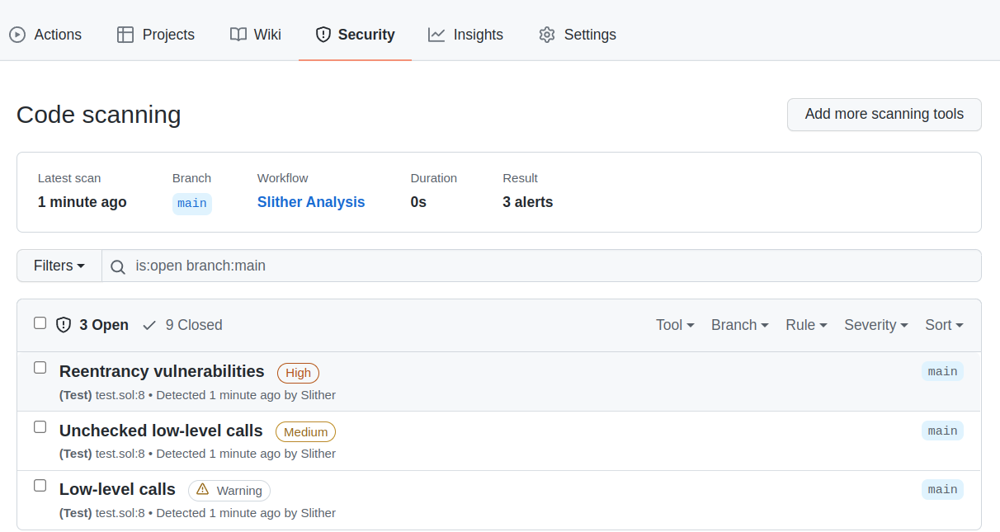
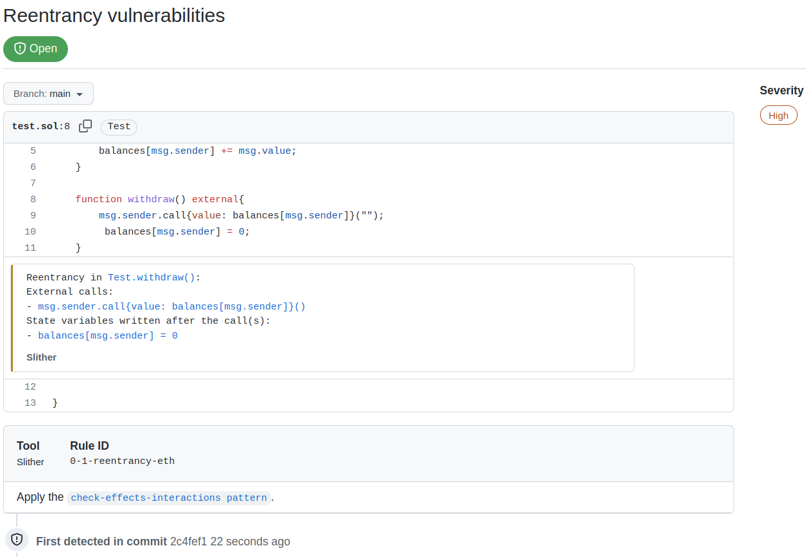

# Slither Action

This action allows you to run the [Slither static
analyzer](https://github.com/crytic/slither) against your project, from within a
GitHub Actions workflow.

To learn more about [Slither](https://github.com/crytic/slither) itself, visit
its [GitHub repository](https://github.com/crytic/slither) and [wiki
pages](https://github.com/crytic/slither/wiki).

- [How to use](#how-to-use)
- [Github Code Scanning integration](#github-code-scanning-integration)
- [Examples](#examples)

# How to use

Create `.github/workflows/slither.yml`:
```yaml
name: Slither Analysis
on: [push]
jobs:
  analyze:
    runs-on: ubuntu-latest
    steps:
      - uses: actions/checkout@v3
      - uses: crytic/slither-action@v0.1.1
```

## Options

| Key              | Description
|------------------|------------
| `ignore-compile` | If set to true, the Slither action will not attempt to compile the project. False by default. See [Advanced compilation](#advanced-compilation).
| `node-version`   | The version of `node` to use. If this field is not set, the latest version will be used.
| `sarif`          | If provided, the path of the SARIF file to produce, relative to the repo root (see [Github Code Scanning integration](#github-code-scanning-integration)).
| `slither-args`   | Extra arguments to pass to Slither. 
| `slither-config` | The path to the Slither configuration file. By default, `./slither.config.json` is used if present. See [Configuration file](https://github.com/crytic/slither/wiki/Usage#configuration-file).
| `slither-version`| The version of slither-analyzer to use. By default, the latest release in PyPI is used.
| `solc-version`   | The version of `solc` to use. If this field is not set, the version will be guessed from project metadata. **This only has an effect if you are not using a compilation framework for your project** -- i.e. if `target` is a standalone `.sol` file.
| `target`         | The path to the root of the project to be analyzed by Slither. Can be a directory or a file. Defaults to the repo root.

## Advanced compilation

If the project requires advanced compilation setting, set `ignore-compile` to true and follow the compilation steps before running slither. See the [examples](#examples) section.

## Triaging results

Add `//slither-disable-next-line DETECTOR_NAME` before the finding, or use the [Github Code Scanning integration](github-code-scanning-integration).

# Github Code Scanning integration

The action supports the Github Code Scanning integration, which will push slither's alerts to the Security tab of the Github project (see [About code scanning](https://docs.github.com/en/code-security/code-scanning/automatically-scanning-your-code-for-vulnerabilities-and-errors/about-code-scanning)). This integration eases the triaging of findings and improves the continious integration.

## Code Scanning preview

### Findings Summary


### Findings Details


## How to use

To enable the integration, use the `sarif` option, and upload the Sarif file to `codeql-action`:

```yaml
name: Slither Analysis
on: [push]
jobs:
  analyze:
    runs-on: ubuntu-latest
    steps:
      - name: Run Slither
        uses: crytic/slither-action@v0.1.1
        id: slither
        continue-on-error: true
        with:
          sarif: results.sarif

      - name: Upload SARIF file
        uses: github/codeql-action/upload-sarif@v2
        with:
          sarif_file: ${{ steps.slither.outputs.sarif }}
```

Here:
- `continue-on-error: true` is required to let the SARIF upload step runs if slither finds issues
- `id: slither` is the name used in for `steps.slither.outputs.sarif`

# Examples

## Example workflow: simple action

The following is a complete GitHub Actions workflow example. It will trigger on
pushes to the repository, and leverage the Node.js integration in the Slither
action to install the latest `node` version, install dependencies, and build the
project that lives in `src/`. Once that is complete, Slither will run its
analysis. The workflow will fail if findings are found.

```yaml
name: Slither Analysis
on: [push]
jobs:
  analyze:
    runs-on: ubuntu-latest
    steps:
      - uses: actions/checkout@v3
      - uses: crytic/slither-action@v0.1.1
        with:
          target: 'src/'
```

## Example workflow: Hardhat and SARIF

The following is a complete GitHub Actions workflow example. It will trigger
with commits on `master` as well as any pull request opened against the `master`
branch. It leverages the NodeJS integration in the Slither action to set up
NodeJS 16.x and install project dependencies before running Slither on the
project. Slither will output findings in SARIF format, and those will get
uploaded to GitHub.

We include `continue-on-error: true` on the Slither action, to avoid failing the
run if findings are found.

```yaml
name: Slither Analysis

on:
  push:
    branches: [ master ]
  pull_request:
    branches: [ master ]

jobs:
  analyze:
    runs-on: ubuntu-latest
    permissions:
      contents: read
      security-events: write
    steps:
    - name: Checkout repository
      uses: actions/checkout@v3

    - name: Run Slither
      uses: crytic/slither-action@v0.1.1
      continue-on-error: true
      id: slither
      with:
        node-version: 16
        sarif: results.sarif

    - name: Upload SARIF file
      uses: github/codeql-action/upload-sarif@v2
      with:
        sarif_file: ${{ steps.slither.outputs.sarif }}
```

## Example workflow: Brownie and SARIF

The following is a complete GitHub Actions workflow example. It will trigger
with commits on `master` as well as any pull request opened against the `master`
branch. It leverages the Python integration in the Slither action to set up a
virtual environment and install project dependencies before running Slither on
the project. Slither will output findings in SARIF format, and those will get
uploaded to GitHub.

We also include `continue-on-error: true` on the Slither action, to avoid
failing the run if findings are found.

```yaml
name: Slither Analysis

on:
  push:
    branches: [ master ]
  pull_request:
    branches: [ master ]

jobs:
  analyze:
    runs-on: ubuntu-latest
    permissions:
      contents: read
      security-events: write
    steps:
    - name: Checkout repository
      uses: actions/checkout@v3

    - name: Run Slither
      uses: crytic/slither-action@v0.1.1
      continue-on-error: true
      id: slither
      with:
        sarif: results.sarif

    - name: Upload SARIF file
      uses: github/codeql-action/upload-sarif@v2
      with:
        sarif_file: ${{ steps.slither.outputs.sarif }}
```

## Example workflow: Dapp

The following is a complete GitHub Actions workflow example, meant to illustrate
the usage of the Slither action when the compilation framework is not based on
Node or Python. It will trigger with commits on `master` as well as any pull
request opened against the `master` branch. To be able to build the project, it
will configure Node and Nix on the runner, and install project dependencies.
Once the environment is ready, it will build the project (using `make build` via
`nix-shell`) and finally run Slither on the project using the GitHub action.

In this example, we are leveraging `ignore-compile` to avoid building the
project as part of the Slither action execution. Slither will expect the project
to be pre-built when this option is set. This allows us to use compilation
frameworks which are not Node or Python-based, such as Dapp, together with the
Slither action.

```yaml
name: Slither Analysis

on:
  push:
    branches: [ master ]
  pull_request:
    branches: [ master ]

jobs:
  analyze:
    runs-on: ubuntu-latest
    steps:
    - name: Checkout repository
      uses: actions/checkout@v3
      with:
          submodules: recursive

    - name: Set up Node
      uses: actions/setup-node@v2

    - name: Install Yarn
      run: npm install --global yarn

    - name: Install Nix
      uses: cachix/install-nix-action@v16

    - name: Configure Cachix
      uses: cachix/cachix-action@v10
      with:
        name: dapp

    - name: Install dependencies
      run: nix-shell --run 'make'

    - name: Build the contracts
      run: nix-shell --run 'make build'

    - name: Run Slither
      uses: crytic/slither-action@v0.1.1
      with:
        ignore-compile: true
```
